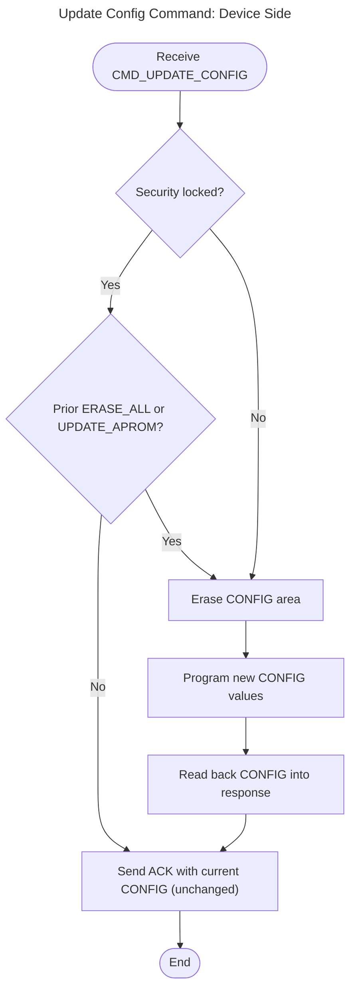
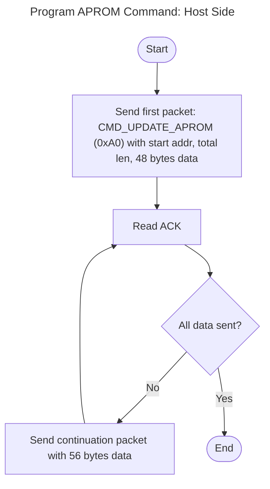
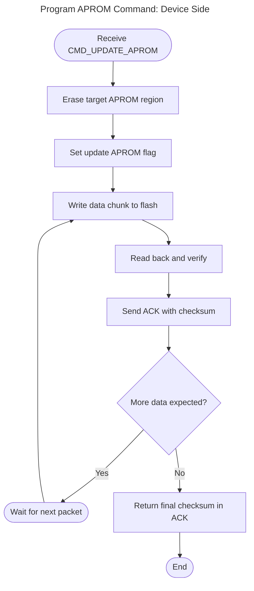
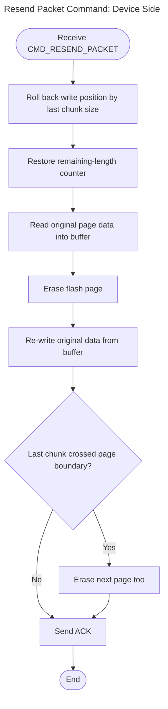
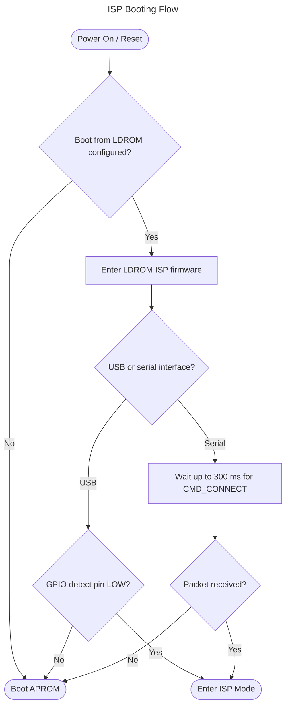
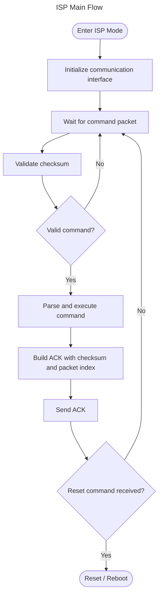

# Protocol Overview

The ISP protocol uses fixed-size 64-byte packets for all communication between the host (PC) and the target device. Every command sent by the host receives either an ACK packet or no response (for reset commands). The protocol includes checksum validation and sequential packet numbering to ensure data integrity.


## Packet Structure

### Host → Device (Command Packet)

All fields are little-endian unsigned integers.

| Byte Offset | Size | Field | Description |
|:-----------:|:----:|-------|-------------|
| 0–3 | 4 | Command | Command code (e.g., `0x000000A0`). Set to `0x00000000` for continuation packets. |
| 4–7 | 4 | Packet Index | Sequential packet counter. |
| 8–63 | 56 | Payload | Command-specific data. Unused bytes are zero-padded. |

### Device → Host (ACK Packet)

| Byte Offset | Size | Field | Description |
|:-----------:|:----:|-------|-------------|
| 0–1 | 2 | Checksum | 16-bit checksum of the corresponding command packet. |
| 2–3 | 2 | (reserved) | — |
| 4–7 | 4 | Packet Index | Must equal the command packet's index minus 1. |
| 8–63 | 56 | Payload | Response data. |

> **Note:** For USB HID, an extra report ID byte (0x00) is prepended to all packets, making them 65 bytes on the wire. The byte offsets above refer to the logical payload starting after the report ID.

## Checksum

The checksum is a simple 16-bit sum of all 64 bytes of the command packet:

```c
unsigned short Checksum(const unsigned char *buf, int len) {
    unsigned short c = 0;
    for (int i = 0; i < len; i++)
        c += buf[i];
    return c;
}
```

The host computes the checksum after building the command packet and stores it locally. When the ACK packet arrives, the host compares bytes 0–1 of the ACK against the stored checksum. A mismatch indicates a transmission error.

The CAN interface does not use checksum validation.

## Packet Sequencing

Each command/ACK exchange uses a packet index to detect duplicates and ordering errors.

**Rules:**

- The host initializes the packet index to `1` after `CMD_SYNC_PACKNO`.
- After each successful `WriteFile`, the host increments the index by 2.
- The ACK packet's index must equal the command's index minus 1.
- If the ACK index or checksum doesn't match, the host sets a resend flag and may retry with `CMD_RESEND_PACKET`.

**Example sequence:**

| Step | Host Sends (Index) | Device Returns (Index) |
|------|--------------------|------------------------|
| SYNC_PACKNO | 1 | 0 |
| GET_VERSION | 3 | 2 |
| GET_DEVICEID | 5 | 4 |
| READ_CONFIG | 7 | 6 |


# Communication Interfaces

All interfaces share the same ISP command set (Section 3) except CAN, which uses a reduced command set (Section 4).

For distinct ISP connectivity scenarios, see the [Introduction](https://github.com/OpenNuvoton/ISPTool/blob/master/Documents/NuMicro_ISP_Programming_User_Manual/NuMicro_ISP_Programming_User_Manual.md#introduction) section of the User Manual.

For wiring details, refer to the **Hardware Connection** chapter of the [Nu-Link2 and Nu-Link3 User Manual](https://github.com/OpenNuvoton/Nuvoton_Tools/blob/master/Documents/Nu-Link2_Nu-Link3_User_Manual/Nu-Link2_Nu-Link3_User_Manual.md).

## USB HID

Direct connection between the host PC and the target MCU. The MCU's LDROM ISP firmware implements a USB HID device.

| Property | Value |
|----------|-------|
| Vendor ID | `0x0416` |
| Product ID | `0x3F00` (ISP FW version ≥ 0x30) |
| Packet size | 65 bytes (1-byte report ID + 64-byte payload) |

## UART

Serial connection at 115200 baud (8N1). Packet size is 64 bytes (no report ID).

## SPI / I²C / RS485 / LIN / CAN (Bridge)

These interfaces require a **Nu-Link2-Pro** or **Nu-Link3-Pro** adapter in ISP-Bridge mode. The adapter bridges USB HID on the PC side to the selected physical interface on the target side.

**Nu-Link2-Pro setup:** Connect to PC via USB, then set `BRIDGE-MODE=2` in `NU_CFG.TXT` on the device disk.  
**Nu-Link3-Pro:** No additional configuration required.

Byte 2 of the HID report selects the target interface:

| Interface | ID |
|-----------|----|
| SPI | 3 |
| I²C | 4 |
| RS485 | 5 |
| CAN | 6 |
| LIN | 7 |

> **Note:** CAN uses a fundamentally different packet format and a reduced command set (4 commands only, no checksum). See [Section 4](#4-can-command-set).

## Wi-Fi / BLE

Wi-Fi and BLE use an external wireless module (e.g., ESP32-C3) as a UART bridge. These interfaces do **not** use USB HID — they communicate over TCP/IP or Bluetooth LE directly, with 64-byte packets.

| Property | Wi-Fi | BLE |
|----------|-------|-----|
| Transport | TCP/IP | Bluetooth LE |
| Default address | `192.168.4.1:333` | — |
| Service UUID | — | `0xABF0` |
| Write characteristic | — | `0xABF1` |
| Notify characteristic | — | `0xABF2` |


# ISP Command Set

All command codes are 32-bit little-endian values. Timeouts noted below are the host-side defaults.

**Timeout constants:**

- Standard: 5,000 ms
- Long (erase/program): 25,000 ms

## CMD_CONNECT (0xAE)

Handshake command to detect whether ISP is running.

**Command packet:**

| Byte Offset | Size | Field |
|:-----------:|:----:|-------|
| 0–3 | 4 | Command (`0x000000AE`) |
| 4–7 | 4 | Packet Index |
| 8–63 | 56 | (unused, zero-padded) |

**ACK packet:**

| Byte Offset | Size | Field |
|:-----------:|:----:|-------|
| 0–1 | 2 | Checksum |
| 2–3 | 2 | (reserved) |
| 4–7 | 4 | Packet Index |
| 8–11 | 4 | Device capability ID |

**Behavior:**

- If capability ID is `0x001540EF`, the device supports SPI Flash commands.
- After a successful connect, the host resets the packet index to 3.
- The host should send this command repeatedly until the device responds (auto-detect polling).
- On the device side, receiving CMD_CONNECT resets the internal packet counter to 1.


## CMD_SYNC_PACKNO (0xA4)

Resets the packet sequence counter. Must be called before any other command.

**Command packet:**

| Byte Offset | Size | Field |
|:-----------:|:----:|-------|
| 0–3 | 4 | Command (`0x000000A4`) |
| 4–7 | 4 | Packet Index |
| 8–11 | 4 | Sync value (initial packet index, e.g., `0x00000001`) |

**ACK packet:**

| Byte Offset | Size | Field |
|:-----------:|:----:|-------|
| 0–1 | 2 | Checksum |
| 2–3 | 2 | (reserved) |
| 4–7 | 4 | Packet Index |
| 8–63 | 56 | (unused) |

**Behavior:**

- The host resets its packet index to 1 before sending this command.
- The Sync payload (bytes 8–11) is set to the current packet index (1).
- The device unconditionally sets its internal packet counter to the Sync value.
- ACK index validation is skipped for this command.


## CMD_GET_VERSION (0xA6)

Returns the ISP firmware version.

**Command packet:**

| Byte Offset | Size | Field |
|:-----------:|:----:|-------|
| 0–3 | 4 | Command (`0x000000A6`) |
| 4–7 | 4 | Packet Index |
| 8–63 | 56 | (unused, zero-padded) |

**ACK packet:**

| Byte Offset | Size | Field |
|:-----------:|:----:|-------|
| 0–1 | 2 | Checksum |
| 2–3 | 2 | (reserved) |
| 4–7 | 4 | Packet Index |
| 8 | 1 | Firmware version (e.g., `0x30`) |


## CMD_GET_DEVICEID (0xB1)

Returns the chip's device identification register.

**Command packet:**

| Byte Offset | Size | Field |
|:-----------:|:----:|-------|
| 0–3 | 4 | Command (`0x000000B1`) |
| 4–7 | 4 | Packet Index |
| 8–63 | 56 | (unused, zero-padded) |

**ACK packet:**

| Byte Offset | Size | Field |
|:-----------:|:----:|-------|
| 0–1 | 2 | Checksum |
| 2–3 | 2 | (reserved) |
| 4–7 | 4 | Packet Index |
| 8–11 | 4 | Device ID (e.g., `0x00235100` for M2351) |

The host uses the device ID to determine APROM size and resolve the part number from the device database.


## CMD_READ_CONFIG (0xA2)

Reads 14 CONFIG register DWORDs from the device.

**Command packet:**

| Byte Offset | Size | Field |
|:-----------:|:----:|-------|
| 0–3 | 4 | Command (`0x000000A2`) |
| 4–7 | 4 | Packet Index |
| 8–63 | 56 | (unused, zero-padded) |

**ACK packet:**

| Byte Offset | Size | Field |
|:-----------:|:----:|-------|
| 0–1 | 2 | Checksum |
| 2–3 | 2 | (reserved) |
| 4–7 | 4 | Packet Index |
| 8–11 | 4 | CONFIG[0] |
| 12–15 | 4 | CONFIG[1] |
| … | … | … |
| 60–63 | 4 | CONFIG[13] |

Total: 56 bytes (14 × 4-byte).


## CMD_READ_CONFIG_EXT (0xE0)

Reads a single CONFIG register by index. Used for chips with extended configuration (M3331, CM3031 series — 19 CONFIG words).

**Command packet:**

| Byte Offset | Size | Field |
|:-----------:|:----:|-------|
| 0–3 | 4 | Command (`0x000000E0`) |
| 4–7 | 4 | Packet Index |
| 8–11 | 4 | Config index (for indices 16–18, send index + 16) |

**ACK packet:**

| Byte Offset | Size | Field |
|:-----------:|:----:|-------|
| 0–1 | 2 | Checksum |
| 2–3 | 2 | (reserved) |
| 4–7 | 4 | Packet Index |
| 8–11 | 4 | CONFIG[index] |

## CMD_UPDATE_CONFIG (0xA1)

Writes 14 CONFIG register DWORDs to the device. Timeout: 25,000 ms.

**Command packet:**

| Byte Offset | Size | Field |
|:-----------:|:----:|-------|
| 0–3 | 4 | Command (`0x000000A1`) |
| 4–7 | 4 | Packet Index |
| 8–11 | 4 | CONFIG[0] |
| 12–15 | 4 | CONFIG[1] |
| … | … | … |
| 60–63 | 4 | CONFIG[13] |

**ACK packet:** Same layout — the device reads back and returns the written values for verification.

When ISP receives the command, it checks the security lock state. If locked **and** no prior `CMD_ERASE_ALL` or `CMD_UPDATE_APROM` was received, the update is silently skipped. If unlocked (or if the chip was erased first), ISP erases the CONFIG area, programs the new values, reads them back, and returns them in the ACK.




## CMD_UPDATE_CONFIG_EXT (0xE1)

Writes CONFIG registers in 2-DWORD pairs by index. Used for M3331/CM3031 series. Timeout: 25,000 ms.

**Command packet:**

| Byte Offset | Size | Field |
|:-----------:|:----:|-------|
| 0–3 | 4 | Command (`0x000000E1`) |
| 4–7 | 4 | Packet Index |
| 8–11 | 4 | Config index (aligned to even, index 16–18 uses index + 16) |
| 12–15 | 4 | CONFIG[index] |
| 16–19 | 4 | CONFIG[index + 1] (or `0xFFFFFFFF` if out of range) |

**ACK packet:**

| Byte Offset | Size | Field |
|:-----------:|:----:|-------|
| 0–1 | 2 | Checksum |
| 2–3 | 2 | (reserved) |
| 4–7 | 4 | Packet Index |
| 8–11 | 4 | CONFIG[index] (read back) |
| 12–15 | 4 | CONFIG[index + 1] (read back) |

## CMD_ERASE_ALL (0xA3)

Erases APROM, Data Flash, and CONFIG area. CONFIG registers are restored to defaults (`0xFFFFFF7F`, `0x0001F000`). Timeout: 25,000 ms.

**Command packet:**

| Byte Offset | Size | Field |
|:-----------:|:----:|-------|
| 0–3 | 4 | Command (`0x000000A3`) |
| 4–7 | 4 | Packet Index |
| 8–63 | 56 | (unused, zero-padded) |

**ACK packet:**

| Byte Offset | Size | Field |
|:-----------:|:----:|-------|
| 0–1 | 2 | Checksum |
| 2–3 | 2 | (reserved) |
| 4–7 | 4 | Packet Index |
| 8–63 | 56 | (unused) |


## CMD_UPDATE_APROM (0xA0)

Programs APROM flash in multi-packet chunks. Timeout: 25,000 ms.

### First Packet

| Byte Offset | Size | Field |
|:-----------:|:----:|-------|
| 0–3 | 4 | `0x000000A0` (command) |
| 4–7 | 4 | Packet index |
| 8–11 | 4 | Start address |
| 12–15 | 4 | Total length |
| 16–63 | 48 | First data chunk (up to 48 bytes) |

### Continuation Packets

| Byte Offset | Size | Field |
|:-----------:|:----:|-------|
| 0–3 | 4 | `0x00000000` (no command — continuation marker) |
| 4–7 | 4 | Packet index |
| 8–63 | 56 | Data chunk (up to 56 bytes) |

Each ACK confirms the previous chunk. The host continues sending until all `Total Length` bytes have been transmitted.

When ISP receives the first command packet, it erases the target APROM region (excluding Data Flash), then writes the data to flash. After each chunk, it calculates and returns a checksum in the ACK. When all data has been received, the full data checksum is returned.






## CMD_UPDATE_DATAFLASH (0xC3)

Programs Data Flash (NVM). The packet format is identical to `CMD_UPDATE_APROM`.

> **Note:** The *Start Address* parameter in the first packet is ignored by ISP for this command. ISP erases the entire Data Flash and programs from the beginning of the Data Flash region.


## CMD_ERASE_SPIFLASH (0xD0)

Erases SPI flash in 64 KB blocks. One command per block. Timeout: 25,000 ms per block.

**Command packet:**

| Byte Offset | Size | Field |
|:-----------:|:----:|-------|
| 0–3 | 4 | Command (`0x000000D0`) |
| 4–7 | 4 | Packet Index |
| 8–11 | 4 | Block offset (0, 0x10000, 0x20000, …) |

The host loops from `offset = 0` to `total_length`, incrementing by 64 KB each iteration.

## CMD_UPDATE_SPIFLASH (0xD1)

Programs SPI Flash in chunks. Timeout: 25,000 ms per chunk.

**Command packet:**

| Byte Offset | Size | Field |
|:-----------:|:----:|-------|
| 0–3 | 4 | Command (`0x000000D1`) |
| 4–7 | 4 | Packet Index |
| 8–11 | 4 | Address (start + bytes written so far) |
| 12–15 | 4 | Chunk length (max 48 bytes) |
| 16–63 | 48 | Data |

The host loops, sending up to 48 bytes per packet until all data is transmitted.

## CMD_RUN_APROM (0xAB)

Instructs the device to reset and boot from APROM.

**Command packet:**

| Byte Offset | Size | Field |
|:-----------:|:----:|-------|
| 0–3 | 4 | Command (`0x000000AB`) |
| 4–7 | 4 | Packet Index |
| 8–63 | 56 | (unused, zero-padded) |

**ACK:** None. The device resets immediately — no response is expected. Wait ~500 ms before assuming the device has rebooted.

**Device behavior:** ISP sets the BS bit to 0 in the ISPCON register and issues SYSRESETREQ to the AIRCR register. The system then reboots from APROM.


## CMD_RUN_LDROM (0xAC)

Instructs the device to reset and boot from LDROM.

**Command packet:**

| Byte Offset | Size | Field |
|:-----------:|:----:|-------|
| 0–3 | 4 | Command (`0x000000AC`) |
| 4–7 | 4 | Packet Index |
| 8–63 | 56 | (unused, zero-padded) |

**ACK:** None. Same behavior as CMD_RUN_APROM.

**Device behavior:** ISP sets the BS bit to 1 in the ISPCON register and issues SYSRESETREQ to the AIRCR register. The system then reboots from LDROM.


## CMD_RESET (0xAD)

Instructs the device to perform a hardware reset.

**Command packet:**

| Byte Offset | Size | Field |
|:-----------:|:----:|-------|
| 0–3 | 4 | Command (`0x000000AD`) |
| 4–7 | 4 | Packet Index |
| 8–63 | 56 | (unused, zero-padded) |

**ACK:** None.

**Device behavior:** ISP issues SYSRESETREQ to the AIRCR register. The system reboots.


## CMD_WRITE_CHECKSUM (0xC9)

Writes the application program length and checksum into the last 8 bytes of APROM. Issued after APROM update is complete.

**Command packet:**

| Byte Offset | Size | Field |
|:-----------:|:----:|-------|
| 0–3 | 4 | Command (`0x000000C9`) |
| 4–7 | 4 | Packet Index |
| 8–11 | 4 | Total application length |
| 12–15 | 4 | Application checksum |

**ACK packet:**

| Byte Offset | Size | Field |
|:-----------:|:----:|-------|
| 0–1 | 2 | Checksum |
| 2–3 | 2 | (reserved) |
| 4–7 | 4 | Packet Index |
| 8–63 | 56 | (unused) |

**Device behavior:** ISP determines the APROM size, then writes the total length and checksum to the last 8 bytes of APROM.


## CMD_GET_FLASHMODE (0xCA)

Retrieves the boot selection (BS) bit to determine whether the device is running from APROM or LDROM.

**Command packet:**

| Byte Offset | Size | Field |
|:-----------:|:----:|-------|
| 0–3 | 4 | Command (`0x000000CA`) |
| 4–7 | 4 | Packet Index |
| 8–63 | 56 | (unused, zero-padded) |

**ACK packet:**

| Byte Offset | Size | Field |
|:-----------:|:----:|-------|
| 0–1 | 2 | Checksum |
| 2–3 | 2 | (reserved) |
| 4–7 | 4 | Packet Index |
| 8–11 | 4 | Mode: `1` = running in APROM, `2` = running in LDROM |

**Device behavior:** ISP reads the ISPCON register to get the BS bit and returns the mode value. If currently running in APROM, issue `CMD_RUN_LDROM` to reboot into ISP mode.


## CMD_RESEND_PACKET (0xFF)

Requests the device to re-transmit its last ACK. Used for error recovery.

**Command packet:**

| Byte Offset | Size | Field |
|:-----------:|:----:|-------|
| 0–3 | 4 | Command (`0x000000FF`) |
| 4–7 | 4 | Packet Index |
| 8–63 | 56 | (unused, zero-padded) |

**Behavior:** ACK index validation is skipped for this command. The device rolls back the last chunk written during APROM or Data Flash programming: it reverses the write position and remaining-length counters, erases the affected flash page, and restores its original content. The host can then re-send the failed chunk.




# CAN Command Set

The CAN interface uses a different packet format and a reduced command set due to device-side code size constraints.

## CAN Packet Structure

### Host → Device (CAN Command)

| Byte Offset | Size | Field |
|:-----------:|:----:|-------|
| 0 | 1 | Reserved (0x00) |
| 1 | 1 | Reserved |
| 2 | 1 | Interface ID (`6`) |
| 3–6 | 4 | CAN command code |
| 7–10 | 4 | CAN data parameter |
| 11–64 | 54 | Zeros |

### Device → Host (CAN Response)

| Byte Offset | Size | Field |
|:-----------:|:----:|-------|
| 1–4 | 4 | Echo of CAN command code |
| 5–8 | 4 | Response data |

**Validation:** The host verifies that bytes 1–4 match the sent command code. No checksum is used.

## CAN Commands

| Command | Code | Data Parameter | Response Data |
|---------|:----:|----------------|---------------|
| `CAN_CMD_GET_DEVICEID` | `0xB1000000` | (unused) | Device ID |
| `CAN_CMD_READ_CONFIG` | `0xA2000000` | Config address | Config value |
| `CAN_CMD_RUN_APROM` | `0xAB000000` | (unused) | (no response) |
| `CAN_CMD_SECOND_READ` | `0xB3000000` | Address | Verification data |

**CAN CONFIG read** iterates over CONFIG register addresses starting at `0x00300000`:

```
Address = 0x00300000 + (index × 4)
```

For chips with special CONFIG base (M460, M2L31, M55M1), the base address is `0x0F300000`.

## CAN APROM Programming Flow

CAN programs APROM in 8-byte (two 4-byte DWORD) steps:

```
FOR each 8-byte block at cur_addr:
  1. WriteFileCAN(cur_addr,     first_4_bytes)   → ReadFileCAN() verifies echo
  2. WriteFileCAN(cur_addr + 4, second_4_bytes)  → ReadFileCAN() verifies echo
  3. WriteFileCAN(CAN_CMD_SECOND_READ, cur_addr + 4) → ReadFileCAN() final verify
  4. cur_addr += 8
```


# Programming Workflow

## ISP Booting Flow

At boot phase, NuMicro® MCU fetches code from either LDROM or APROM, controlled by the CONFIG0 register. The "boot from LDROM" option must be configured before running ISP programming. The ISP entry condition depends on the interface:

- **USB HID:** The GPIO detect pin must be LOW to enter ISP mode. If HIGH, the firmware jumps to APROM.
- **UART / SPI / I²C / RS485 / CAN:** The firmware waits up to 300 ms for a `CMD_CONNECT` packet. If no packet arrives within the timeout, the firmware jumps to APROM.




## ISP Main Flow

Once ISP mode is entered, the ISP program enters a command parsing loop, processing commands from the active interface and executing the corresponding operations.




### Connection Sequence

```
1. Open_Port()          — Open USB HID, COM port, or bridge device
2. CMD_Connect()        — Poll until device responds (auto-detect)
3. ReOpen_Port()        — Clear buffers after initial connection
4. SyncPackno()         — Reset packet counter
5. GetVersion()         — Read ISP firmware version
6. GetDeviceID()        — Read chip device ID
7. ReadConfig()         — Read CONFIG registers
```

If the chip has more than 14 CONFIG registers, use `ReadConfig_Ext()` in a loop for indices 0–18 instead of `ReadConfig()` (e.g., M3331/CM3031 series).

### Device Identification

After reading the device ID, the host resolves:

1. **Part number** — Mapped from the device ID via a lookup table (e.g., `0x00235100` → `M2351KIAAE`).
2. **Flash layout** — APROM size, Data Flash address/size, and LDROM size are determined from the device ID and CONFIG register values.
3. **Capabilities** — SPI Flash support, extended CONFIG support, and 64-bit programming mode are detected from the device ID and connect response.


4. **Flash size resolution** — The flash layout (APROM size, Data Flash address/size) depends on the CONFIG registers and varies by chip series. Refer to the chip's TRM for details.

### Programming Sequence

The ISP Tool executes these phases in order:

```
Phase 1: Erase (optional)
  └─ CMD_ERASE_ALL
  └─ CMD_READ_CONFIG  (refresh after erase)

Phase 2: Write CONFIG (optional)
  ├─ Standard: CMD_UPDATE_CONFIG
  └─ Extended: CMD_UPDATE_CONFIG_EXT (loop, step 2)
  └─ Verify: compare written vs read-back values

Phase 3: Recalculate flash sizes
  └─ UpdateSizeInfo(DeviceID, CONFIG0, CONFIG1)

Phase 4: Program APROM (optional)
  └─ CMD_SYNC_PACKNO
  └─ CMD_UPDATE_APROM  (loop with retry)

Phase 5: Program Data Flash (optional)
  └─ CMD_SYNC_PACKNO
  └─ CMD_UPDATE_DATAFLASH  (loop with retry)

Phase 6: SPI Flash (optional, if supported)
  └─ CMD_ERASE_SPIFLASH  (loop per 64 KB block)
  └─ CMD_UPDATE_SPIFLASH  (loop per 48-byte chunk)

Phase 7: Run APROM (optional)
  └─ CMD_RUN_APROM
```

## Retry and Error Recovery

During APROM and Data Flash programming, each chunk allows up to 10 retries. If the ACK checksum or packet index does not match, the host sends `CMD_RESEND_PACKET` to roll back the failed write and re-sends the chunk. If all retries are exhausted (or the failure occurs on the first chunk), the operation is aborted with an error.

---

# API Reference

## ISPLdCMD Class

The low-level ISP protocol implementation.

### Interface Setup

```cpp
void SetInterface(unsigned int it, CString sComNum, CString sIPAddress, CString sIPPort);
ULONG GetInterface() const;
bool Open_Port();
void Close_Port();
void ReOpen_Port(BOOL bForce = FALSE);
bool Check_USB_Link();
```

### Command Methods

| Method | Returns | Description |
|--------|---------|-------------|
| `CMD_Connect(DWORD ms = 30)` | `BOOL` | Send connect handshake. Polls with given timeout. |
| `CMD_Resend()` | `BOOL` | Re-request last ACK from device. |
| `SyncPackno()` | `void` | Reset packet sequence to 1. |
| `GetVersion()` | `unsigned char` | Read ISP firmware version byte. |
| `GetDeviceID()` | `unsigned long` | Read 32-bit device ID. |
| `ReadConfig(unsigned int config[])` | `void` | Read 14 CONFIG DWORDs. |
| `ReadConfig_Ext(unsigned int config[], unsigned int i)` | `void` | Read extended CONFIG word at index `i`. |
| `UpdateConfig(unsigned int config[], unsigned int response[])` | `void` | Write 14 CONFIG DWORDs, receive read-back. |
| `UpdateConfig_Ext(unsigned int config[], unsigned int response[], unsigned int i)` | `void` | Write extended CONFIG pair at index `i`. |
| `EraseAll()` | `BOOL` | Erase APROM + Data Flash + CONFIG. |
| `UpdateAPROM(start_addr, total_len, cur_addr, buffer, *update_len, program_64bit)` | `void` | Program one APROM chunk. |
| `UpdateNVM(start_addr, total_len, cur_addr, buffer, *update_len, program_64bit)` | `void` | Program one NVM chunk. |
| `RunAPROM()` | `BOOL` | Reset and boot from APROM. |
| `RunLDROM()` | `BOOL` | Reset and boot from LDROM. |
| `Cmd_ERASE_SPIFLASH(offset, total_len)` | `BOOL` | Erase SPI Flash in 64 KB blocks. |
| `Cmd_UPDATE_SPIFLASH(offset, total_len, buffer)` | `BOOL` | Program SPI Flash in chunks. |

### Public State

| Field | Type | Description |
|-------|------|-------------|
| `bResendFlag` | `BOOL` | Set by `ReadFile()` on checksum/index mismatch. |
| `m_bSupport_SPI` | `BOOL` | Device supports SPI Flash commands. |
| `m_bSpecConfigAddr` | `BOOL` | Device uses alternate CONFIG base `0x0F300000`. |

## CISPProc Class

The high-level programming state machine.

### Thread States

| Method | Purpose |
|--------|---------|
| `Thread_CheckUSBConnect()` | Open port and poll for device. |
| `Thread_CheckDeviceConnect()` | Read version, device ID, CONFIG. |
| `Thread_ProgramFlash()` | Execute the full programming sequence. |
| `Thread_CheckDisconnect()` | Wait for user action (GUI mode). |
| `Thread_Idle()` | Final cleanup. |

### Programming Flags

| Field | Type | Description |
|-------|------|-------------|
| `m_bProgram_APROM` | `BOOL` | Program APROM binary. |
| `m_bProgram_NVM` | `BOOL` | Program Data Flash binary. |
| `m_bProgram_Config` | `BOOL` | Write CONFIG registers. |
| `m_bProgram_SPI` | `BOOL` | Program SPI Flash binary. |
| `m_bErase` | `BOOL` | Erase chip before programming. |
| `m_bErase_SPI` | `BOOL` | Erase SPI Flash. |
| `m_bRunAPROM` | `BOOL` | Boot from APROM after programming. |

### Memory Layout Fields

| Field | Type | Description |
|-------|------|-------------|
| `m_uAPROM_Addr` | `unsigned int` | APROM base address. |
| `m_uAPROM_Size` | `unsigned int` | APROM region size (bytes). |
| `m_uAPROM_Offset` | `unsigned int` | Programming offset within APROM. |
| `m_uNVM_Addr` | `unsigned int` | Data Flash base address. |
| `m_uNVM_Size` | `unsigned int` | Data Flash region size (bytes). |
| `m_ulDeviceID` | `unsigned int` | Connected device ID. |
| `m_ucFW_VER` | `unsigned char` | ISP firmware version. |
| `m_CONFIG[19]` | `unsigned int[]` | Current device CONFIG values. |
| `m_CONFIG_User[19]` | `unsigned int[]` | User-modified CONFIG values. |

## Error Codes

| Code | Name | Description |
|:----:|------|-------------|
| 0 | `EPS_OK` | Success. |
| 1 | `EPS_ERR_OPENPORT` | Failed to open communication port. |
| 2 | `EPS_ERR_CONNECT` | Device did not respond to CMD_CONNECT. |
| 3 | `EPS_ERR_CONFIG` | CONFIG write verification mismatch. |
| 4 | `EPS_ERR_APROM` | APROM programming failed after retries. |
| 5 | `EPS_ERR_NVM` | Data Flash programming failed after retries. |
| 6 | `EPS_ERR_SIZE` | Binary file exceeds device flash capacity. |
| 7 | `EPS_PROG_DONE` | Programming completed successfully. |
| 8 | `EPS_ERR_ERASE` | Chip erase operation failed. |
| 9 | `EPS_ERR_SPI` | SPI Flash operation failed. |
